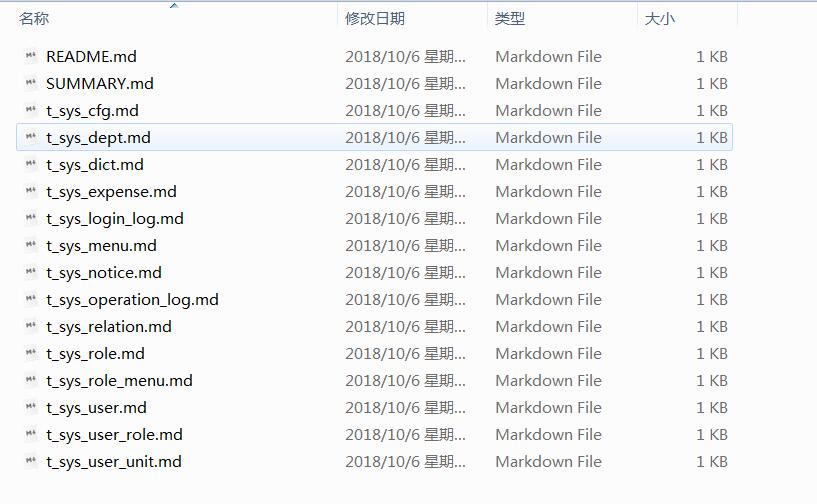

# 数据库文档生成器

- 这是一个简单的小工具，可以根据数据库表结构生成数据库设计文档（格式包括markdown，html，word)，支持数据库（MySQL,Oracle,PostgreSQL)
- 如果你嫌PowerDesigner太重，那么可以试试该工具。
- 你可以下载[release](https://github.com/enilu/database-doc-generator/releases/tag/1.0)包来或者下载[源代码](https://github.com/enilu/database-doc-generator)来使用。
- 如果使用源代码，需要先克隆该项目后运行mvn package打包，然后运行发布包中的bin/start.bat
- 运行程序后按照下面提示输入对应数据库参数：

```bash
choose database:
1:mysql
2:oracle
3:PostgreSQL
Select the appropriate numbers choose database type
(Enter 'c' to cancel): 3
input database name:
gunslite
input host:
localhost
input port:
5432
input username:
enilu
input password:
123456

```
- 输入完成后回车，即可生成数据库文档目录${dbname}-doc,目录中文档以markdown文件为载体：



- 确保安装了gitbook后，进入上述文件目录的命令行窗口运行：gitbook serve
```bash
E:\\database-doc-generator-20181006100721\web-flash-doc>gitbook serve
openssl config failed: error:02001003:system library:fopen:No such process
Live reload server started on port: 35729
Press CTRL+C to quit ...

info: 7 plugins are installed
info: loading plugin "livereload"... OK
info: loading plugin "highlight"... OK
info: loading plugin "search"... OK
info: loading plugin "lunr"... OK
info: loading plugin "sharing"... OK
info: loading plugin "fontsettings"... OK
info: loading plugin "theme-default"... OK
info: found 15 pages
info: found 0 asset files
info: >> generation finished with success in 1.6s !

Starting server ...
Serving book on http://localhost:4000
```
- 访问 http://localhost:4000，即可在线查看数据库文档


- 另外还可以生成word文档哦;虽然有点简陋:

