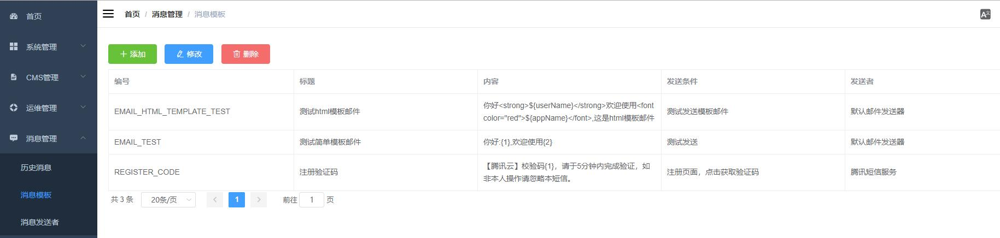

# 消息中心

## 功能
消息中心提供了发送短信和发送邮件的基础功能,并且提供了历史发送消息列表，内容如下：
- 历史消息, 展示所有历史发送消息清单


- 消息模板 配置消息内容模板

- 消息发送者 配置具体的消息发送服务，比如系统默认内置了腾讯云的短信发送api作为短信发送服务，当然你可以配置自己的


## 开发手册

###  配置新的短信模板
比如用户注册的时候需要发送短信验证码，那么就需要配置短信模板，短信模板的关键内容有三个
- 短信编码，用于发送短信的时候做模板标识
- 内容，发送的短信内容模板
- 短信发送器，配置使用的短信发送服务（比如使用腾讯短信或者阿里短信等等之类）
示例


配置完毕后就可以在适当的场景下调用发送短信：
```java
@Autowired
private MessageService messageService;
//三个参数分别为短信模板编号,接收者手机号，短信内容中的参数，在该模板中及{1}对应的参数
 messageService.sendSms("REGISTER_CODE", "15021292929", "2322");
```
### 新增短信发送器
本系统默认内置了腾讯的发送短信服务，你只要更改下api相关配置即可使用。你也可能需要用其他的短信服务，那么就需要开发自己的短信发送器，步骤如下：
- 参考cn.enilu.flash.service.message.sms.tencent.TencentSmsSender 实现一个SmsSender
- 在消息发送者界面配置新的发送器，发送器名称为新增的类名（首字母小写）

- 然后在短信模板界面选择新增的短信发送器即可

### 配置邮件模板
邮件发送和短信一样，首先配置邮件模板，然后调用即可，一般情况下不会需要新增邮件发送器，默认的就可以用了；下面是调用示例：
```java
//发送简单邮件
messageService.sendSimpleEmail("EMAIL_TEST", "fromAccount@qq.com", 
"toAccount@qq.com", null, "简单模板邮件", "张三", "web-flash");
//发送html模板复杂邮件
messageService.sendTplEmail("EMAIL_HTML_TEMPLATE_TEST", "fromAccount@qq.com",
 "toAccount@qq.com", null, "html模板邮件", Maps.newHashMap("userName", "李四", "appName", "WEB-FLASH"));
//发送带附件的邮件
messageService.sendTplEmail("EMAIL_HTML_TEMPLATE_TEST", "fromAccount@qq.com", 
"toAccount@qq.com", null, "带附件的邮件",
"测试附件.txt",new FileSystemResource(new File("d:\\test.txt")),
Maps.newHashMap("userName", "李四", "appName", "WEB-FLASH"));
```


**PS** 这个功能大部分代码是用代码生成器生成的，如果你还没有用过，可以试试这个[代码生成器](../ecosystem/code-generator.md)