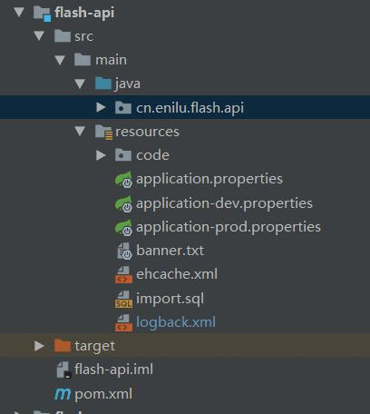
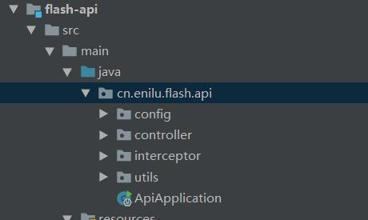

# 基本包结构

本节详细说明本项目的基本目录结构

## web-flash模块

web-flash包含4个模块：
- flash-api
- flash-vue-admin
- flash-vue-h5
- flash-core

具体每个包里的细节不详细介绍，开发人员可以在使用过程中了解，本身代码量并不大，了解起来不需要花费太多时间。

这里仅详细说明下flash-api的内部结构，毕竟日常开发主要是基于该模块来做的。

## flash-api
flash-api是一个标准的是后台数据接口服务

目录结构包含：

- src/main/java  java源码
- src/main/resources  配置文件
这里介绍下guns-admin的基本目录和开发流程

### src/main/java/ 源代码

目录结构如下所示：

- **config** 该package 包含项目支持各种特性的相关配置。例如：
    - 跨域配置
    - json配置
    - EhCache缓存配置
    - 支持swagger在线文档的配置
    - 审计功能配置
    - 权限配置
- **controller** 控制层   
- **interceptor** 拦截器   
- **utils** api相关工具类

