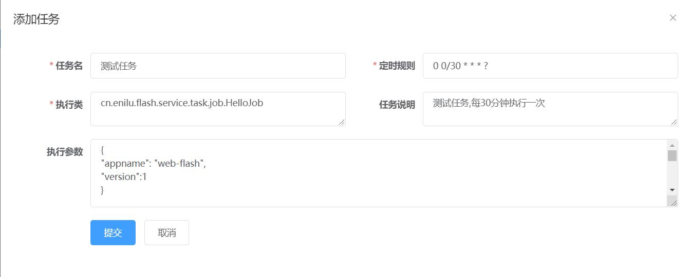
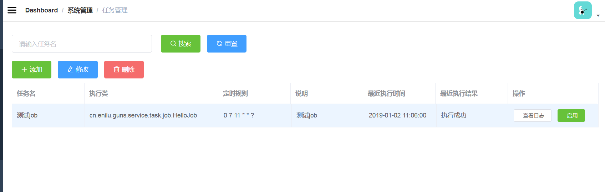

# 定时任务管理
这两年做的项目和产品几乎多有定时任务管理的需求。
常用的场景有：
- 定时给用户发送一些消息
- 定时进行一些报表的计算
- 定时去指定的接口get一些数据
- 定时将一些报表发送到指定的邮箱

当然还有很多，不一一列举

## 需求

定时任务的需求通常是这样的
- 1 需要添加一个定时任务，做一些事情。但是什么时候做要我自己配置，而且还想配置一些参数进去，比如我想定时给指定的email发送邮件.
- 2 可以临时禁用一个任务。
- 3 看定时任务执行的历史日志。

## 实现方法
web-flash对定时任务管理功能的实现如下。

## 表结构
web-flash提供了两个表：t_sys_task（任务）和t_sys_task_log(任务执行日志)

- t_sys_task
```sql
CREATE TABLE `t_sys_task` (
  `id` bigint(64) NOT NULL AUTO_INCREMENT COMMENT '自增主键',
  `name` varchar(50) DEFAULT NULL COMMENT '任务名',
  `job_group` varchar(50) DEFAULT NULL COMMENT '任务组',
  `job_class` varchar(255) DEFAULT NULL COMMENT '执行类',
  `note` varchar(255) DEFAULT NULL COMMENT '任务说明',
  `cron` varchar(50) DEFAULT NULL COMMENT '定时规则',
  `data` text COMMENT '执行参数',
  `exec_at` datetime DEFAULT NULL COMMENT '执行时间',
  `exec_result` text COMMENT '执行结果',
  `disabled` tinyint(1) DEFAULT NULL COMMENT '是否禁用',
  `createtime` datetime DEFAULT NULL,
  `creator` bigint(20) DEFAULT NULL,
  `concurrent` tinyint(4) DEFAULT '0' COMMENT '是否允许并发',
  PRIMARY KEY (`id`)
) ENGINE=InnoDB AUTO_INCREMENT=1 DEFAULT CHARSET=utf8; 
```
- t_sys_task_log

```sql
CREATE TABLE `t_sys_task_log` (
  `id` bigint(64) NOT NULL AUTO_INCREMENT COMMENT '自增主键',
  `name` varchar(50) DEFAULT NULL COMMENT '任务名',
  `exec_at` datetime DEFAULT NULL COMMENT '执行时间',
  `exec_success` int(11) DEFAULT NULL COMMENT '执行结果（成功:1、失败:0)',
  `job_exception` varchar(255) DEFAULT NULL COMMENT '抛出异常',
  `id_task` bigint(20) DEFAULT NULL,
  PRIMARY KEY (`id`)
) ENGINE=InnoDB AUTO_INCREMENT=1 DEFAULT CHARSET=utf8; 
```

### 创建一个定时任务类

比如本项目提供了一个测试定时任务：
```java
package cn.enilu.flash.service.task.job;
import cn.enilu.flash.service.task.JobExecuter;
import org.springframework.stereotype.Component;
@Component
public class HelloJob extends JobExecuter {
    @Override
    public void execute(Map<String, Object> dataMap) throws Exception {
        //具体业务逻辑：获取id为1的系统参数记录，修改其备注信息
        System.out.println("定时任务配置参数 :"+JsonUtil.toJson(dataMap));
        Cfg cfg = cfgService.get(1L);
        cfg.setCfgDesc("update by " + DateUtil.getTime());
        cfgService.update(cfg);
        logger.info("hello :" + JsonUtil.toJson(dataMap));
    }
}

```

### 页面配置一个定时任务
在任务管理页面可以增上改查一个定时任务，还可以禁用、启用定时任务

- 添加定时任务


- 定时任务列表

- 查看定时任务执行历史日志


