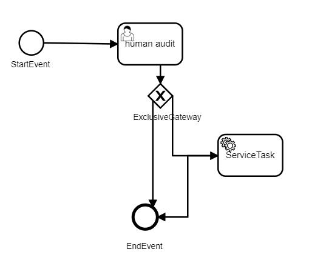

# 工作流
- 本项目集成了aciviti工作流引擎提供了基本的工作流功能。
- 如果你不需要工作流，可以通过下面方法去掉工作流模块（毕竟本项目48张表，有27张表都是工作流的）
    - 删除flash-workflow工作流模块
    - 删除配置文件application-*.yml中工作流相关配置
        ```properties
            activiti:
              #配置为true的时候自动检查resources/bpmn/目录下的工作流定义文件并部署到数据库表中
              check-process-definitions: false
              #启动的时候配置为true初始化工作流相关表
              database-schema-update: update
              history-level: full
              db-history-used: true
              process-definition-location-prefix: classpath:/bpmn/
        ```
     - 删除前端界面项目flash-vue-admin中工作流相关内容
        ```
            删除src/api/workflow目录
            删除public/bpmnjs目录
            删除src/views/workflow目录
        ```

## 使用
- 系统内置一个测试流程

- 其中任何人都可以发起一个流程申请
- 初审用户auditUser/123456
- 终审用户为自动化审核
- 系统内置bpmnjs作为流程在线设计器，开发过程中，请参考其[官方文档](https://bpmn.io/toolkit/bpmn-js/)