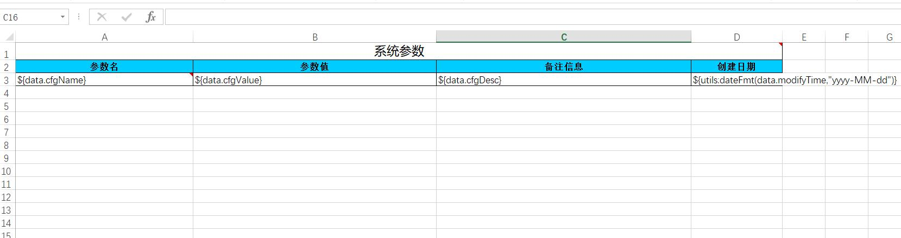

# 导出excel

“系统管理”-“参数管理”功能实现了导出excel功能，具体开发可以参考该功能。

下面说下具体的实现步骤：

数据导出功能是使用[jxls](http://jxls.sourceforge.net)实现的

## 使用

### 引入jxls依赖
```xml
<dependency>
    <groupId>org.jxls</groupId>
    <artifactId>jxls</artifactId>
    <version>2.3.0</version>
</dependency>
<dependency>
    <groupId>org.jxls</groupId>
    <artifactId>jxls-poi</artifactId>
    <version>1.0.9</version>
</dependency>
```
### 准备excel模板
- 默认情况下模板都放在flash-api/src/main/resources/templates/
- 模板如下所示：



### 准备数据并根据模板生成excel文件
- 参考类：cn.enilu.flash.api.controller.system.CfgController的export方法
```java
    /**
     * 导出参数列表
     * @param cfgName
     * @param cfgValue
     * @return
     */
    @RequestMapping(value = "/export",method = RequestMethod.GET)
    public Object export(@RequestParam(required = false) String cfgName, @RequestParam(required = false) String cfgValue) {
        Page<Cfg> page = new PageFactory<Cfg>().defaultPage();
        page = cfgService.findPage(page, Maps.newHashMap("cfgName",cfgName,"cfgValue",cfgValue));
        page.setRecords(page.getRecords());
        FileInfo fileInfo = fileService.createExcel("templates/config.xlsx","系统参数.xlsx",Maps.newHashMap("list",page.getRecords()));
        return Rets.success(fileInfo);
    }
```
- 页面用法为，首先调用上述"export"地址生成excel，后台返回生成的excel文件id，前台使用该文件id下载生成好的excel文件,参考代码：web-flash\flash-vue-admin\src\views\system\cfg\cfg.js
```js
exportXls(this.listQuery).then(response => {
    window.location.href= getApiUrl() + '/file/download?idFile='+response.data.id
})
```

**注**后台FileService中封装了一个生成excel文件的方法，具体逻辑参考代码
```java
/**
 * 根据模板创建excel文件
 * @param template excel模板
 * @param fileName 导出的文件名称
 * @param data  excel中填充的数据
 * @return
 */
public FileInfo createExcel(String template, String fileName, Map<String, Object> data)

```


值得注意的是，导出的excel文件会在存放在t_sys_file_info表中和对应的系统目录下，如果导出功能使用频率比较高的话，时间久了会生成很多文件信息。
那么就需要定时清理这些数据。

聪明的你一定想到用定时任务来做这件事情。如果你对定时任务不熟悉，可以参考这个文档：[定时任务管理](../action/task.md)
