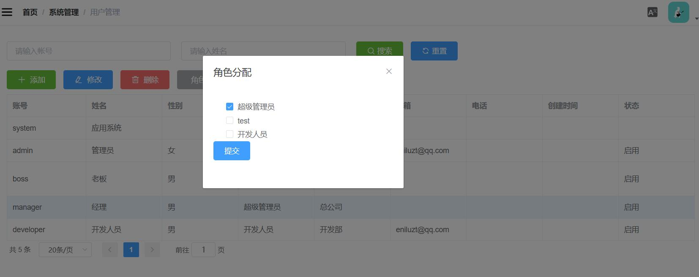

# 权限管理
权限管理内容包括权限的配置，登陆认证，权限校验等部分。

## 权限配置
权限管理的核心为控制角色对菜单和按钮的访问，所以权限配置主要包含以下内容的维护:

- 菜单管理： 维护要控制的页面菜单和按钮

- 角色管理： 为角色配置可以访问的菜单和按钮

- 用户管理： 为用户配置角色


## 权限控制
权限的实现步骤如下：
- 配置拦截器
- 左侧菜单导航的权限控制（页面权限控制和路由生成）
- 页面功能的权限控制（按钮权限控制）

 ## 配置拦截器

- cn.enilu.flash.api.interceptor.JwtFilter为权限拦截器，
- 具体针对哪些地址做什么样的处理策略，参考：cn.enilu.flash.api.config.ShiroConfig中的配置


## 左侧菜单导航的权限控制
用户登陆成功后，会根据用户所拥有的角色配置的菜单生成路由表数据返回到前端：cn.enilu.flash.api.controller.AccountController：
```java
//获取用户可以操作的菜单列表
  List<RouterMenu> list = menuService.getSideBarMenus(shiroUser.getRoleList());
  map.put("menus",list);
```
前端接收到菜单列表信息后根据是否有这些菜单列表的操作权限来生成路由表：flash-vue-admin/src/store/modules/permission.js


## 页面功能（按钮）的权限控制

页面按钮的控制用到[vue-element-admin](https://github.com/PanJiaChen/vue-element-admin)封装的一个指令权限[v-permission](https://github.com/PanJiaChen/vue-element-admin/tree/master/src/directive/permission)，具体用法如下：
```javascript
// js代码
import permission from '@/directive/permission/index.js'
export default {
  directives: { permission },
  .....
```

```html
<!-- vue代码-->
<el-button type="success" icon="el-icon-plus" @click.native="add" v-permission="['/mgr/add']">
           {{$t('button.add') }}
</el-button>
<el-button type="primary" icon="el-icon-edit" @click.native="edit" v-permission="['/mgr/edit']">
 {{$t('button.edit') }}
</el-button> 
```  

完整的示例参考"系统管理"->"用户管理"的代码[/user/index.vue](https://github.com/enilu/web-flash/tree/master/flash-vue-admin/src/views/system/user)


## 备注
权限控制和菜单管理是紧密结合的，请详细阅读菜单管理中的相关字段说明：[菜单管理](menu.md),以便更容易的做好权限控制。