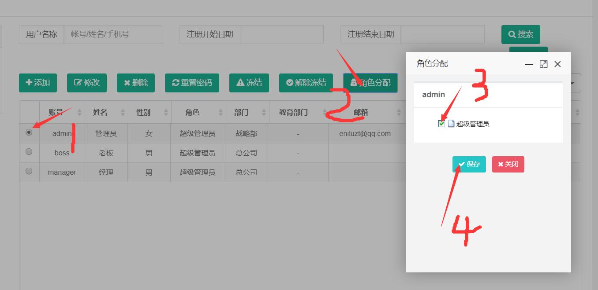

# 添加菜单和分配权限
现在功能已经开发完毕了，但是在页面上并不能使用这个功能；
因为我没有给当前用不配置参数管理的权限。下面分两步骤启用参数管理功能

- 在菜单管理中添加参数管理的功能，包括一个菜单项（点击链接进入列表页面）和三个功能项（新增、删除、修改）
- 在权限管理中给指定的角色配置上述三个菜单
- 在用户管理中给指定的用户配置指定的角色


## 添加菜单项

在菜单管理中添加4条记录,添加过程中要注意一下几点：
 - 父级编号：选中的父级编号决定了当前功能所属哪一个模块，比如“参数管理”这一项的父级编号选择“系统管理”，则“参数管理”这一功能菜单在“系统管理”模块下。
 - 是否是菜单：选择“是”，则菜单会在左侧菜单栏显示，选择“否”，则不会显示在左侧菜单栏。针对按钮功能要选择“否”
 - 请求地址，针对菜单选择“是”的记录，则该地址必须为页面打开的地址，针是否是菜单选择“否”的记录，则该地址必须与页面的判断一致。
 
 ```
比如“添加系统参数”这一项的请求地址为“cfg/add”, 则页面判断是否有操作权限的的代码为：
    
@if(shiro.hasPermission("/cfg/add")){
<#button name="添加" icon="fa-plus" clickFun="Cfg.openAddCfg()"/>
@}
```
    
添加四条菜单记录：
    
- 参数管理
- 添加系统参数
- 修改系统参数
- 删除系统参数


## 为角色配置菜单项


## 为用户配置角色

因为默认的admin账户本身已经有超级管理员角色，所以不需要配置了，不过这里依然列出配置步骤：




