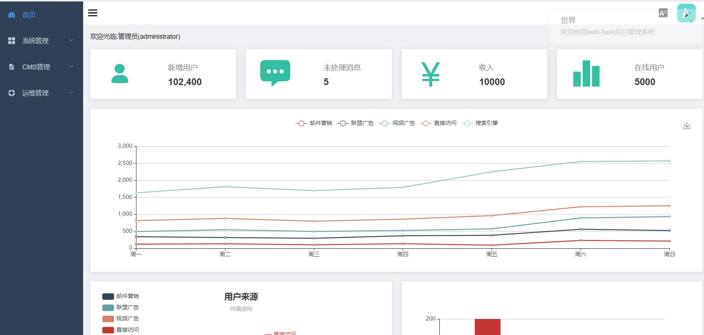

# 启动项目

- 右键直接运行 cn.enilu.guns.admin.AdminApplication 类即可已启动guns-admin后台管理系统
- 系统默认是用8080端口，参考配置文件src/resources/application.properties
```properties
server.port=8080
```
- 启动成功后访问http://localhost:8080 如下图所示

- 输入用户名/密码：admin/admin即可登录：



so，是不是很简单!