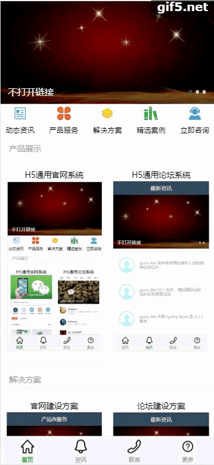

# 启动项目

## 启动flash-api
- 右键直接运行cn.enilu.flash.api.ApiApplication 类即可已启动flash-api
- 启动成功后访问http://localhost:8082/swagger-ui.html

## 启动flash-vue-admin
- 本项目使用Node.js，而Node.js采用gyp作为项目生成工具，所以也需要安装python，请保证妥善安装了Node.js和Python
- 进入flash-vue-admin目录
    - 命令行窗口运行 npm install --registry=https://registry.npm.taobao.org
    - 运行  npm run dev
    - 启动成功后访问 http://localhost:9528,登录，用户名密码:admin/admin 
 

## 启动flash-vue-h5
- 启动步骤和flash-vue-admin类似
- 进入flash-vue-h5目录
    - 运行 npm install --registry=https://registry.npm.taobao.org
    - 运行npm run dev
    - 启动成功后访问 http://localhost:8088/#/index    
 

so，是不是很简单!
