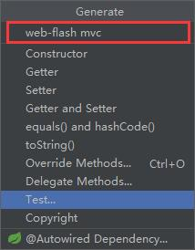
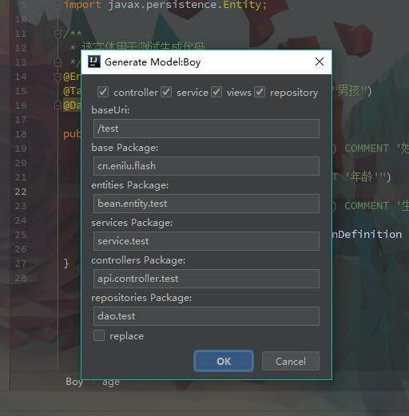
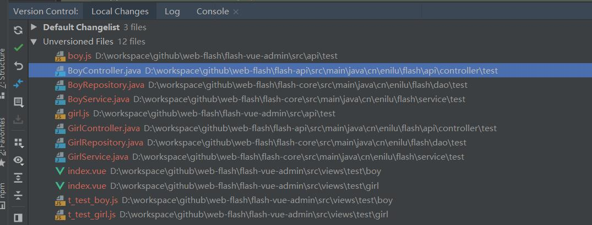
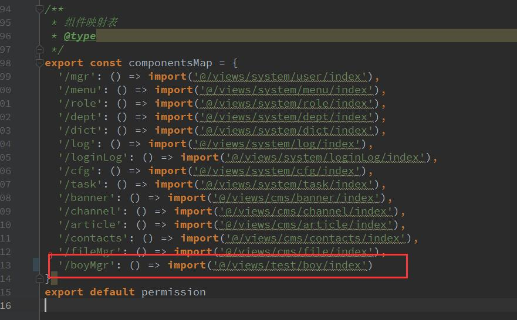
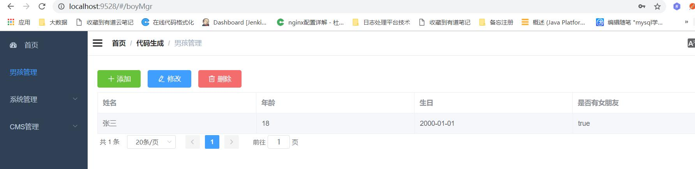

# web-flash代码生成工具
 
- web-flash提供了基于IDEA的插件来生成代码,你可以在idea插件仓库中搜索webflash-generator，或者直接从本地安装插件：flash-generator/idea-plugin.jar即可
- IDEA插件底层通过调用flash-generator模块的代码生成模块来生成代码。
用法如下：
- 首先写好实体类，打开实体类，右键选择Generator(或者Alt+Insert)     

 
 
 - 选择web-flash mvc，在弹框中勾选生成选项 
 
  
 - 点击生成即可，生成完毕后在vue的router/index.js添加路由，启动api和vue项目，配置上菜单和角色后即可使用
        


以Boy实体为例,执行代码生成后将会生成如下文件：


代码生成后，在flash-vue-admin的路由配置文件中flash-vue-admin/src/router/index.js，增加如下内容：
```javascript
      {
        path: 'boy',
        name: 'Boy',
        component:  () => import('@/views/test/boy/index'),
        meta: {
          title: '男孩管理'
        }
      }
```
如下图所示


启动flash-api和flash-vue-admin,配置和菜单和角色权限后就可以访问刚刚生成的代码功能了



        
        
